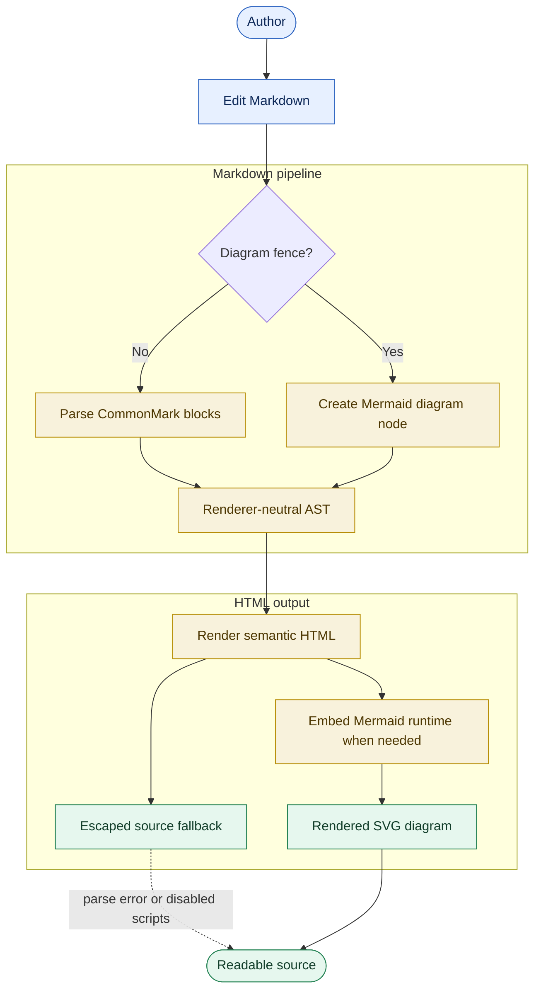
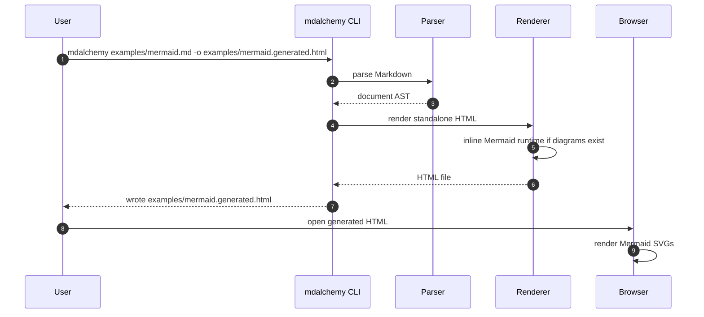
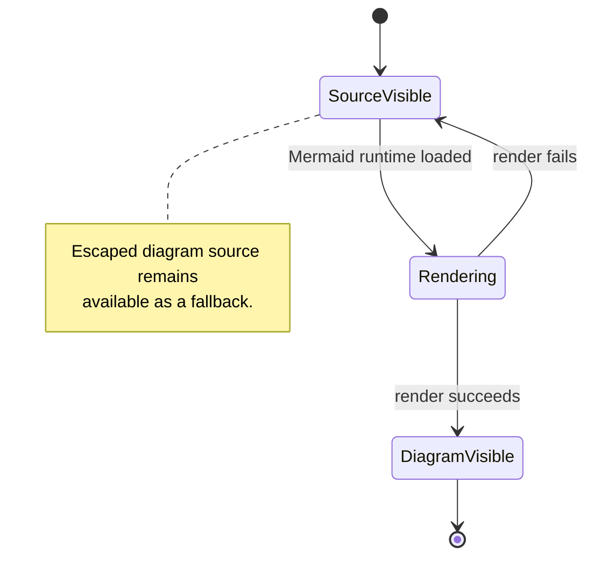

# Mermaid Diagram Fixtures

These fixtures exercise Mermaid rendering without inflating the checked complex
HTML fixture.

## Documentation Pipeline

```mermaid
flowchart TB
  author([Author]) --> edit[Edit Markdown]
  edit --> classify{Diagram fence?}

  subgraph Markdown pipeline
    classify -- No --> parse[Parse CommonMark blocks]
    classify -- Yes --> mermaid[Create Mermaid diagram node]
    parse --> ast[Renderer-neutral AST]
    mermaid --> ast
  end

  subgraph HTML output
    ast --> render[Render semantic HTML]
    render --> fallback[Escaped source fallback]
    render --> runtime[Embed Mermaid runtime when needed]
    runtime --> svg[Rendered SVG diagram]
  end

  fallback -. parse error or disabled scripts .-> reader([Readable source])
  svg --> reader

  classDef input fill:#e7f0ff,stroke:#356ac3,color:#0d2858;
  classDef process fill:#f8f2dc,stroke:#b58b00,color:#4c3600;
  classDef output fill:#e6f7ee,stroke:#238253,color:#113d29;
  class author,edit input;
  class parse,mermaid,ast,render,runtime process;
  class fallback,svg,reader output;
```

## Preview Sequence

```mermaid
sequenceDiagram
  autonumber
  participant User
  participant CLI as mdalchemy CLI
  participant Parser
  participant Renderer
  participant Browser

  User->>CLI: mdalchemy examples/mermaid.md -o examples/mermaid.generated.html
  CLI->>Parser: parse Markdown
  Parser-->>CLI: document AST
  CLI->>Renderer: render standalone HTML
  Renderer->>Renderer: inline Mermaid runtime if diagrams exist
  Renderer-->>CLI: HTML file
  CLI-->>User: wrote examples/mermaid.generated.html
  User->>Browser: open generated HTML
  Browser->>Browser: render Mermaid SVGs
```

## Render State

```mermaid
stateDiagram-v2
  [*] --> SourceVisible
  SourceVisible --> Rendering: Mermaid runtime loaded
  Rendering --> DiagramVisible: render succeeds
  Rendering --> SourceVisible: render fails
  DiagramVisible --> [*]

  note right of SourceVisible
    Escaped diagram source remains
    available as a fallback.
  end note
```
